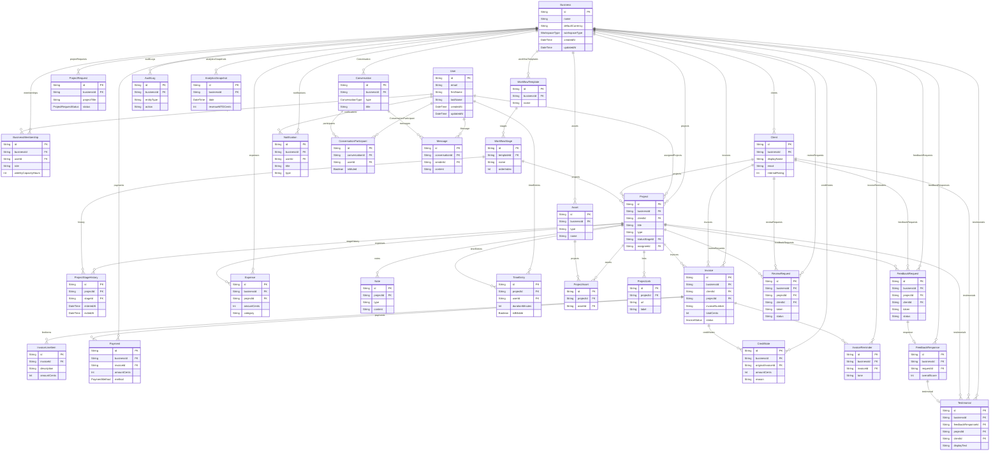

# Prisma Schema ER Diagram

This document contains a Mermaid Entity-Relationship (ER) diagram reflecting the full structure of our `schema.prisma`. 

```mermaid
erDiagram
    Business {
        String id PK
        String name
        String defaultCurrency
        WorkspaceType workspaceType
        DateTime createdAt
        DateTime updatedAt
    }

    User {
        String id PK
        String email
        String firstName
        String lastName
        DateTime createdAt
        DateTime updatedAt
    }

    BusinessMembership {
        String id PK
        String businessId FK
        String userId FK
        String role
        Int weeklyCapacityHours
    }

    Client {
        String id PK
        String businessId FK
        String displayName
        String email
        Int internalRating
    }

    Project {
        String id PK
        String businessId FK
        String clientId FK
        String title
        String type
        String statusStageId FK
        String assigneeId FK
    }

    ProjectRequest {
        String id PK
        String businessId FK
        String projectTitle
        ProjectRequestStatus status
    }

    WorkflowTemplate {
        String id PK
        String businessId FK
        String name
    }

    WorkflowStage {
        String id PK
        String templateId FK
        String name
        Int orderIndex
    }

    ProjectStageHistory {
        String id PK
        String projectId FK
        String stageId FK
        DateTime enteredAt
        DateTime exitedAt
    }

    Invoice {
        String id PK
        String businessId FK
        String clientId FK
        String projectId FK
        String invoiceNumber
        Int totalCents
        InvoiceStatus status
    }

    InvoiceLineItem {
        String id PK
        String invoiceId FK
        String description
        Int amountCents
    }

    Payment {
        String id PK
        String businessId FK
        String invoiceId FK
        Int amountCents
        PaymentMethod method
    }

    Expense {
        String id PK
        String businessId FK
        String projectId FK
        Int amountCents
        String category
    }

    CreditNote {
        String id PK
        String businessId FK
        String originalInvoiceId FK
        Int amountCents
        String reason
    }

    InvoiceReminder {
        String id PK
        String businessId FK
        String invoiceId FK
        String tone
    }

    AuditLog {
        String id PK
        String businessId FK
        String entityType
        String action
    }

    Note {
        String id PK
        String projectId FK
        String type
        String content
    }

    TimeEntry {
        String id PK
        String projectId FK
        String userId FK
        Int durationMinutes
        Boolean isBillable
    }

    Asset {
        String id PK
        String businessId FK
        String type
        String name
    }

    ProjectAsset {
        String id PK
        String projectId FK
        String assetId FK
    }

    ProjectLink {
        String id PK
        String projectId FK
        String url
        String label
    }

    Notification {
        String id PK
        String businessId FK
        String userId FK
        String title
        String type
    }

    FeedbackRequest {
        String id PK
        String businessId FK
        String projectId FK
        String clientId FK
        String token
        String status
    }

    FeedbackResponse {
        String id PK
        String businessId FK
        String requestId FK
        Int overallScore
    }

    Testimonial {
        String id PK
        String businessId FK
        String feedbackResponseId FK
        String projectId FK
        String clientId FK
        String displayText
    }

    ReviewRequest {
        String id PK
        String businessId FK
        String projectId FK
        String clientId FK
        String token
        String status
    }

    AnalyticsSnapshot {
        String id PK
        String businessId FK
        DateTime date
        Int revenueMTDCents
    }

    Conversation {
        String id PK
        String businessId FK
        ConversationType type
        String title
    }

    ConversationParticipant {
        String id PK
        String conversationId FK
        String userId FK
        Boolean isMuted
    }

    Message {
        String id PK
        String conversationId FK
        String senderId FK
        String content
    }

    %% Relationships
    Business ||--o{ BusinessMembership : "memberships"
    User ||--o{ BusinessMembership : "memberships"
    
    Business ||--o{ Client : "clients"
    Business ||--o{ Project : "projects"
    Business ||--o{ ProjectRequest : "projectRequests"
    Business ||--o{ WorkflowTemplate : "workflowTemplates"
    Business ||--o{ Invoice : "invoices"
    Business ||--o{ Payment : "payments"
    Business ||--o{ Expense : "expenses"
    Business ||--o{ CreditNote : "creditNotes"
    Business ||--o{ InvoiceReminder : "invoiceReminders"
    Business ||--o{ AuditLog : "auditLogs"
    Business ||--o{ Asset : "assets"
    Business ||--o{ Notification : "notifications"
    Business ||--o{ FeedbackRequest : "feedbackRequests"
    Business ||--o{ FeedbackResponse : "feedbackResponses"
    Business ||--o{ Testimonial : "testimonials"
    Business ||--o{ ReviewRequest : "reviewRequests"
    Business ||--o{ AnalyticsSnapshot : "analyticsSnapshots"
    Business ||--o{ Conversation : "Conversation"

    User ||--o{ Notification : "notifications"
    User ||--o{ Project : "assignedProjects"
    User ||--o{ TimeEntry : "timeEntries"
    User ||--o{ ConversationParticipant : "ConversationParticipant"
    User ||--o{ Message : "Message"

    Client ||--o{ Project : "projects"
    Client ||--o{ Invoice : "invoices"
    Client ||--o{ FeedbackRequest : "feedbackRequests"
    Client ||--o{ Testimonial : "testimonials"
    Client ||--o{ ReviewRequest : "reviewRequests"

    Project ||--o{ ProjectStageHistory : "stageHistory"
    Project ||--o{ Invoice : "invoices"
    Project ||--o{ Note : "notes"
    Project ||--o{ ProjectLink : "links"
    Project ||--o{ TimeEntry : "timeEntries"
    Project ||--o{ ProjectAsset : "assets"
    Project ||--o{ Expense : "expenses"
    Project ||--o{ FeedbackRequest : "feedbackRequests"
    Project ||--o{ Testimonial : "testimonials"
    Project ||--o{ ReviewRequest : "reviewRequests"

    WorkflowTemplate ||--o{ WorkflowStage : "stages"
    WorkflowStage ||--o{ Project : "projects"
    WorkflowStage ||--o{ ProjectStageHistory : "history"

    Invoice ||--o{ InvoiceLineItem : "lineItems"
    Invoice ||--o{ Payment : "payments"
    Invoice ||--o{ CreditNote : "creditNotes"
    Invoice ||--o{ InvoiceReminder : "reminders"

    Asset ||--o{ ProjectAsset : "projects"

    FeedbackRequest ||--o| FeedbackResponse : "response"
    FeedbackResponse ||--o| Testimonial : "testimonial"

    Conversation ||--o{ ConversationParticipant : "participants"
    Conversation ||--o{ Message : "messages"
```
